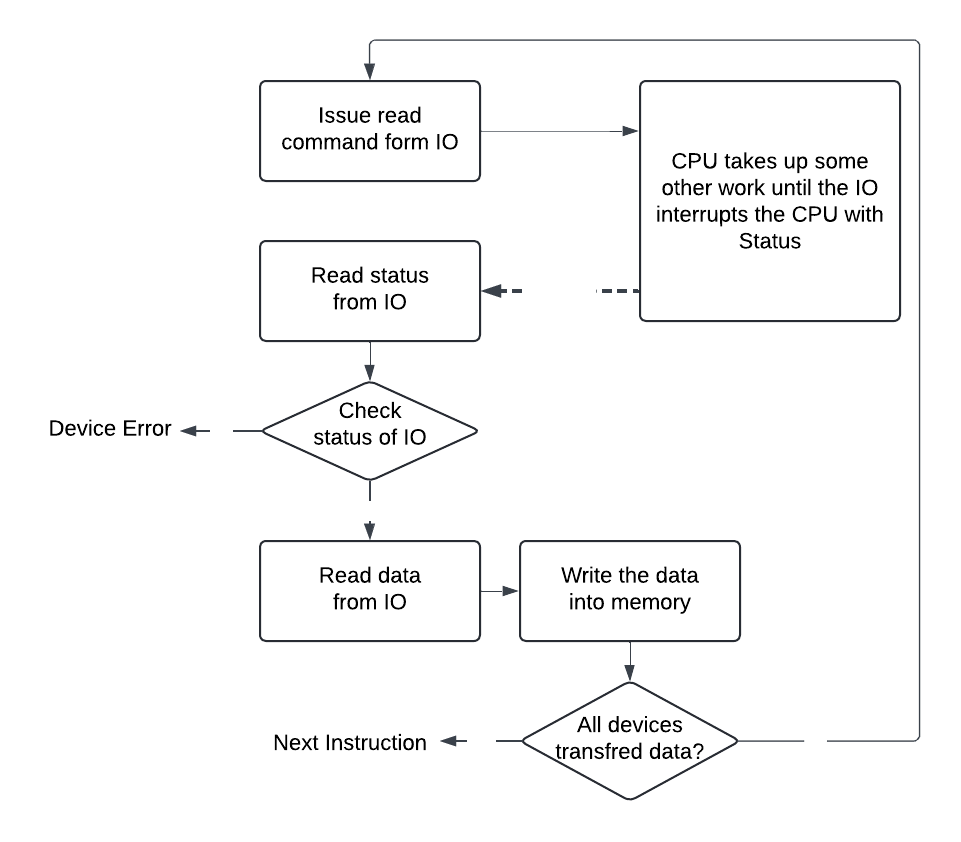

# Interrupt Initiated IO
- Here the CPU doesn't check the status of the IO device, whether it wants to tranfer the data or not.
- However, which IO device wants to Communicate with memory they contact CPU by sending a Interrupt request.
- Based on the priority the CPU sends Interrupt Acknowlodgement(INTA) signal to the concerned IO device.

- The device which recives INTA signal can communicate with memory or they can pass to another device.

- Interrupt will always enchanes the system performance
- Due to the Interrupt the main program execution may delay.

## Diagram




## Types of Interrupts
```
Interrupt
    |- Based on the Device generated
    |   |- Hardware Interrupt
    |   |- Software Interrupt
    |
    |- Based on the Priority
    |   |- High Priority Interrupt
    |   |- Low Priority Interrupt
    |
    |- Based on the Ignorance
    |   |- Maskable Interrupt (Can be ignored)
    |   |- Non-Maskable Interrupt
    |
    |- Based on the Vector Address
        |- Vectored Interrupt (CPU knows what to do when Interrupt occured)
        |- Non-Vectored Interrupt
```